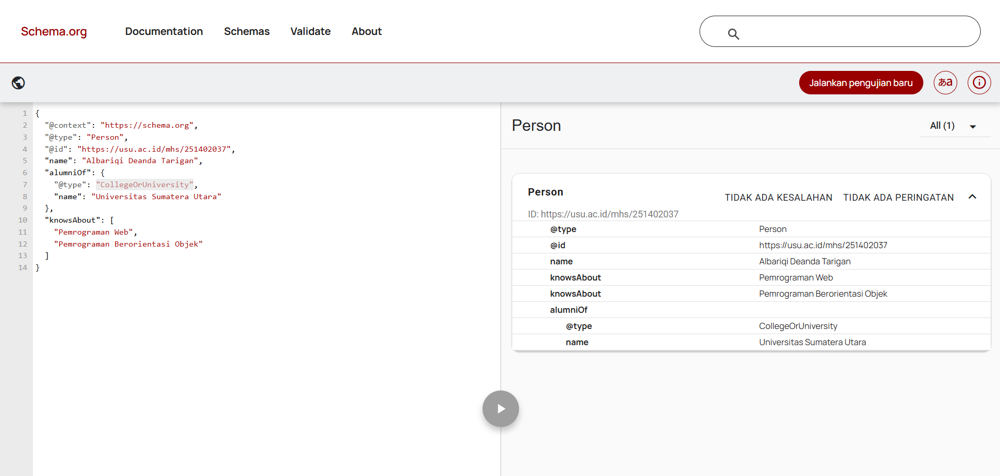
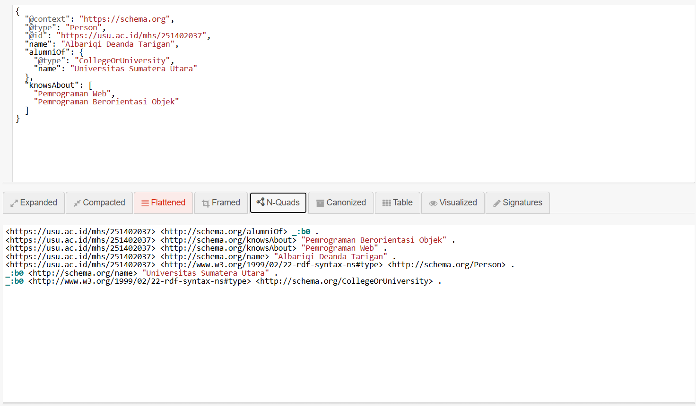
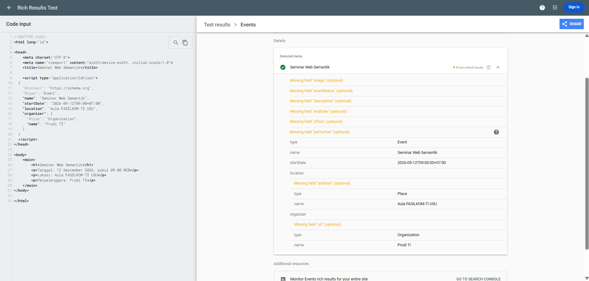

# Latihan Pertemuan 3 - JSON-LD dan Structured Data

## Identitas
- Nama: Albariqi Deanda Tarigan
- NIM: 251402037

## Struktur Hasil
- `profil_saya.jsonld`
- `profil_perbaikan.jsonld`
- `seminar.html`
- folder `screenshots`


## 1. JSON Biasa dan JSON-LD
1. Perbedaan fungsi kunci: Pasangan `nama`/`pekerjaan` bersifat lokal dan hanya dikenali oleh internal aplikasi, sedangkan `name`/`jobTitle` merupakan kunci standar global Schema.org yang dapat dipahami secara universal oleh mesin pencari dan sistem lain.
2. Fungsi `@context`, `@type`, dan `@id`: `@context` mendefinisikan acuan kosa kata standar global (seperti Schema.org), `@type` menentukan tipe atau kategori entitas data (misalnya `Person`), dan `@id` menyediakan identitas unik berupa IRI/URL agar entitas dapat dirujuk di *Web of Data*.
3. Node tanpa `@id`: Node tersebut akan dianggap sebagai *Blank Node* (node anonim); datanya tetap valid secara sintaksis, namun tidak memiliki URI unik yang dapat ditautkan atau dihubungkan oleh dokumen luar.


## 2. Pemeriksaan schema.org
1. Alasan memilih tipe paling spesifik:
  
   Agar mesin pencari memahami konteks data secara presisi, sehingga meningkatkan peluang munculnya hasil pencarian yang lebih detail dan relevan (*rich snippets*).

2. Nama properti dan bahasa nilai: 
 
   Nama properti menggunakan standar global schema.org agar dimengerti mesin secara universal, sementara nilainya menggunakan bahasa Indonesia karena berisi data faktual yang disesuaikan dengan target atau konteks lokal.

3. Manfaat array pada `knowsAbout`: 
   
   Memungkinkan penulisan beberapa topik keahlian sekaligus secara ringkas dan efisien di dalam satu properti, sehingga menghindari pengulangan penulisan kode.


## 3. Perbaikan 5 Kesalahan (Pertemuan 03)

Berikut adalah penjelasan mengenai lima kesalahan sintaks dan skema yang ditemukan pada file JSON-LD awal beserta perbaikannya:

1. **Perbaikan Tipe (`@type`)**
   - **Awal:** `"person"`
   - **Perbaikan:** `"Person"`
   - **Penjelasan:** Schema.org menerapkan aturan *case-sensitivity* di mana nama `@type` harus diawali dengan huruf kapital.

2. **Perbaikan Tanda Kutip**
   - **Awal:** `'name'`
   - **Perbaikan:** `"name"`
   - **Penjelasan:** Spesifikasi sintaks JSON menetapkan bahwa seluruh *key* dan *string value* wajib dibungkus dengan tanda kutip ganda (`"`).

3. **Perbaikan Format Tanggal (`birthDate`)**
   - **Awal:** `"12 September 2004"`
   - **Perbaikan:** `"2004-09-12"`
   - **Penjelasan:** Properti `birthDate` memerlukan format standar ISO 8601 (`YYYY-MM-DD`) agar dapat dibaca oleh *search engine* dan mesin pemroses data secara konsisten.

4. **Perbaikan Properti Kustom (`nomorInduk`)**
   - **Awal:** `"nomorInduk"`
   - **Perbaikan:** `"identifier"`
   - **Penjelasan:** `nomorInduk` bukan merupakan kosakata resmi pada vokabulari `Person` di Schema.org. Properti standar yang digunakan untuk menyimpan nomor identitas unik adalah `identifier`.

5. **Penghapusan Koma Menggantung (*Trailing Comma*)**
   - **Awal:** `"nomorInduk": "221401001",`
   - **Perbaikan:** `"identifier": "221401001"` (tanpa koma di akhir)
   - **Penjelasan:** Struktur JSON yang valid melarang penggunaan koma setelah properti terakhir dalam sebuah *object*.

## 4. Triple dari JSON-LD Playground
Tuliskan satu baris N-Quads yang terbentuk:

```text
ISI_TRIPLE
```

## 5. Hasil Validasi
- Schema Markup Validator: ...
- Rich Results Test: ...
- JSON-LD Playground: ...

## 6. Refleksi
1. Mengapa `@context` disebut jembatan menuju makna?
2. Apa perbedaan fungsi Schema Markup Validator dan Rich Results Test?
3. Mengapa isi JSON-LD harus sama dengan konten yang terlihat pada halaman?

## Bukti



